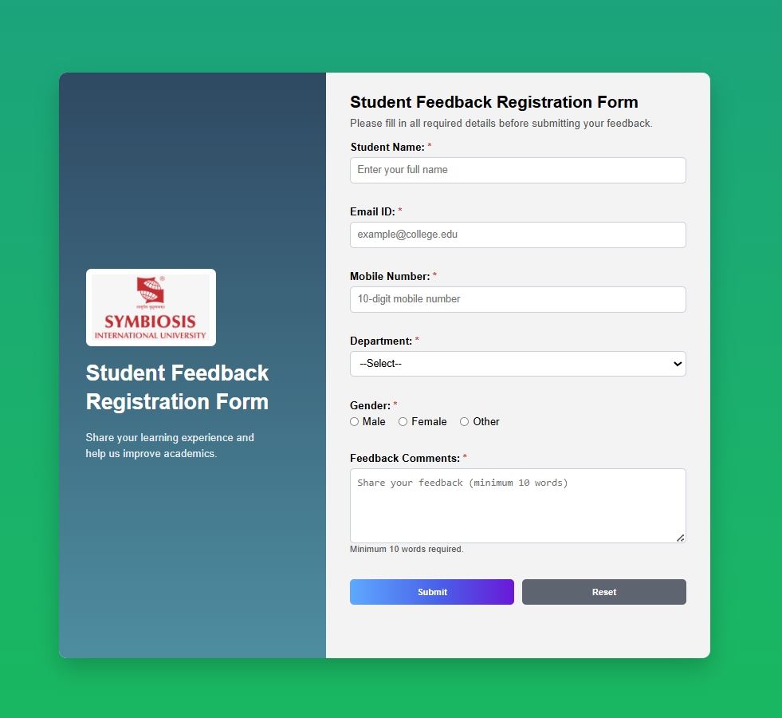
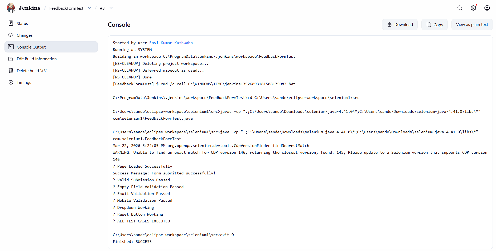

# Student Feedback Registration Form

## Project Overview

The **Student Feedback Registration Form** is a web-based application developed using HTML, CSS, and JavaScript to collect student feedback through an interactive and user-friendly interface. The project demonstrates the complete software development lifecycle by integrating frontend development, client-side validation, automated testing using Selenium (Java), and Continuous Integration using Jenkins.

---

## Objectives

- Design a responsive and user-friendly feedback form.
- Implement client-side validation using JavaScript.
- Automate functional testing using Selenium WebDriver.
- Execute automated tests through Jenkins.
- Demonstrate an end-to-end web application testing workflow.

---

## Technologies Used

| Technology | Purpose |
|------------|---------|
| HTML5 | Structure of the web application |
| CSS3 | Styling and responsive design |
| JavaScript | Client-side form validation |
| Selenium (Java) | Automated functional testing |
| Jenkins | Continuous Integration (CI/CD) |

---

## Features

### Student Feedback Form

The application includes the following fields:

- Student Name
- Email ID
- Mobile Number
- Department (Dropdown)
- Gender (Radio Buttons)
- Feedback Comments
- Submit Button
- Reset Button

### User Interface

- Clean and responsive layout
- Well-structured form design
- Styled input fields and buttons
- Combination of internal and external CSS

### JavaScript Validation

The application validates the following before form submission:

- Student Name cannot be empty.
- Email must be in a valid format.
- Mobile Number must contain exactly **10 digits**.
- Gender selection is mandatory.
- Department must be selected.
- Feedback must contain at least **10 words**.

---

## Selenium Test Automation

The project includes automated test cases for:

- Page Load Verification
- Valid Form Submission
- Empty Field Validation
- Invalid Email Validation
- Invalid Mobile Number Validation
- Department Dropdown Verification
- Submit Button Functionality
- Reset Button Functionality

---

## Jenkins CI/CD Integration

Jenkins is used to automate the execution of Selenium test cases.

### Jenkins Workflow

- Jenkins installed and configured.
- Freestyle project created.
- Project linked through the local workspace.
- Selenium test cases executed automatically.
- Build status monitored using the Jenkins dashboard.

---

## Getting Started

### Run the Web Application

1. Clone the repository.

```bash
git clone https://github.com/<your-username>/DevOps_Student-Feedback-Registration-Form.git
```

2. Open the project folder.

3. Launch `index.html` in any modern web browser.

### Run Selenium Tests

1. Install Java JDK.
2. Configure Selenium dependencies.
3. Download and configure ChromeDriver.
4. Open the project in Eclipse or IntelliJ IDEA.
5. Execute `FeedbackFormTest.java`.

### Run Using Jenkins

1. Open the Jenkins Dashboard.
2. Create a Freestyle Project.
3. Configure the project workspace.
4. Add build steps to execute Selenium test cases.
5. Save the configuration.
6. Trigger a build and verify the build status.

---

## Project Structure

```text
DevOps_Student-Feedback-Registration-Form/
│
├── FeedbackFormTest.java      # Selenium automation test cases
├── Jenkins.png                # Jenkins build screenshot
├── README.md                  # Project documentation
├── Webpage.png                # Application screenshot
├── index.html                 # Student feedback form
├── script.js                  # JavaScript validation
├── style.css                  # CSS styling
└── test.py                    # Python test file
```

---

## Project Screenshots

### Student Feedback Registration Form



### Jenkins Build Status



---

## Expected Outcome

- Responsive and user-friendly feedback registration form.
- Accurate client-side validation.
- Successful execution of Selenium automation test cases.
- Automated test execution using Jenkins.
- Successful Jenkins build status.

---

## Future Enhancements

- Integrate a backend for storing feedback.
- Connect the application with a database.
- Add user authentication and login.
- Generate feedback reports and analytics.
- Implement email notifications after successful submission.

---

## Author

**Ravi Kumar Kushwaha**
